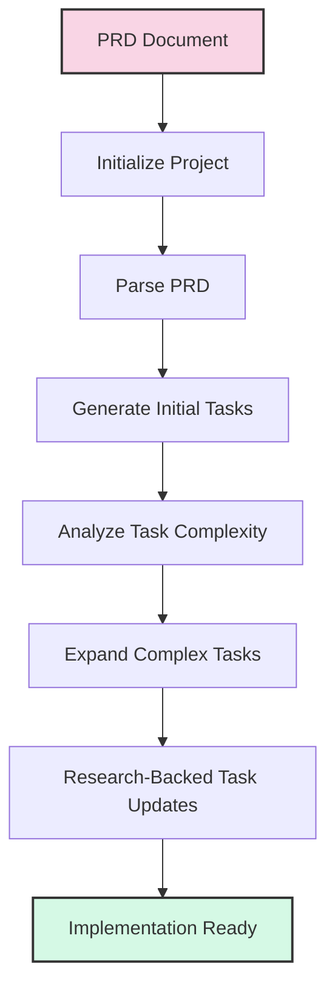

# 3. Moderne AI-udviklingsværktøjer (75 minutter)

### Cline som udviklingspartner
- Kernefunktionaliteter og integrationspunkter
  * Cline tilbyder funktioner som kodegenerering, refaktorering, fejlfindingsassistance og projektanalyse, der integreres direkte i udviklingsarbejdsgange gennem forskellige IDE'er og platforme.
- Effektive promptstrategier specifikt for Cline
  * For at maksimere Clines effektivitet bør prompts være klare, koncise og give tilstrækkelig kontekst, ofte ved at udnytte dens evne til at forstå filstrukturer og projektmål.
- Avancerede funktioner: filoperationer, kommandoeksekvering, konteksthåndtering
  * Cline kan udføre direkte filændringer, eksekvere terminalkommandoer og opretholde en dyb forståelse af projektets kontekst, hvilket muliggør komplekse udviklingsopgaver med flere trin.
- Virkelige brugsmønstre og bedste praksis
  * Bedste praksis inkluderer iterativ promptning, nedbrydning af komplekse opgaver og brug af Cline til gentagen kodning, boilerplate-generering og indledende problemdiagnose.

### Cline i aktion: Interaktiv demo
Denne demo illustrerer, hvordan man effektivt bruger Cline til webudviklingsopgaver, med fokus på Plan/Act-tilstande og kraften i brugerdefinerede regler.

#### Demo oversigt
Følgende eksempel demonstrerer oprettelse af en simpel HTML-side med indlejret JavaScript, der viser en hilsen og inkluderer en knap til at ændre teksten. Vi vil vise, hvordan den samme generelle prompt kan producere forskellige resultater baseret på, om brugerdefinerede regler anvendes.

#### Eksempel 1: Grundlæggende promptning (uden regler)
**Planlægningsfase prompt:**
```
I need to create a simple HTML page with a "Hello, Cline!" message and a button that changes 
the text to "Hello, World!" when clicked. The page should have basic styling. 
Can you help me plan this?
```

**Handlingsfase prompt:**
```
Create a simple HTML page with a "Hello, Cline!" message and a button that changes the text 
to "Hello, World!" when clicked. Add some basic styling to make it look nice. 
Save it in the examples/03-cline directory.
```

Uden specifikke regler ville Cline oprette filen direkte i examples/03-cline-mappen.

#### Eksempel 2: Regelforstærket promptning
**Samme prompts som Eksempel 1, men med en .clinerules fil:**

```markdown
---
description: Rules for web development demos in the 03-cline examples
globs: ["examples/03-cline/**/*.html", "examples/03-cline/**/*.js"]
tags: ["web-demo", "organization"]
---

# Web Demo Output Organization

When creating web-related files (HTML, CSS, JavaScript) for the examples/03-cline directory:

1. **ALWAYS** place these files in the `examples/03-cline/web/` subdirectory
2. **ALWAYS** use the following structure:
   - HTML files in the root of the web directory
   - CSS files in a `css` subdirectory
   - JavaScript files in a `js` subdirectory (unless embedded in HTML)
3. **ALWAYS** include appropriate comments and documentation in the code

This ensures consistent organization of web demo files and improves maintainability.
```

Med denne regel på plads ville de samme prompts resultere i, at Cline placerer filerne i `examples/03-cline/web/`-mappen i stedet, hvilket demonstrerer, hvordan regler kan gøre generelle instruktioner mere præcise uden at kræve, at brugeren er eksplicit i deres prompts.

#### Styrken ved regler
Dette eksempel demonstrerer, hvordan .clinerules kan:
1. Gøre generelle prompts mere præcise
2. Håndhæve konsistent projektorganisering
3. Reducere behovet for detaljerede instruktioner i hver prompt
4. Sikre at bedste praksis følges automatisk

### MCP-servere og udvidelsesmuligheder
- Udvidelse af AI-værktøjer gennem brugerdefinerede tjenester
  * Model Context Protocol (MCP) servere giver udviklere mulighed for at udvide AI-værktøjers funktionaliteter ved at skabe brugerdefinerede tjenester, der tilbyder specialiserede funktioner eller adgang til proprietære data.
  * MCP-servere fungerer som broer mellem AI-værktøjer og eksterne systemer, API'er eller datakilder, hvilket gør det muligt for AI at udføre opgaver ud over dens indbyggede funktionaliteter.
- Skabelse af specialiserede funktionaliteter til domænespecifik udvikling
  * MCP muliggør udvikling af AI-værktøjer skræddersyet til specifikke brancher eller tekniske domæner, der tilbyder yderst relevant og præcis assistance til niche-problemer.
  * Eksempler inkluderer forbindelse til specialiserede databaser, interaktion med proprietære systemer eller integration med branchespecifikke værktøjer og tjenester.
- Fremtidig køreplan for AI-udviklingsværktøjer
  * Fremtiden involverer mere sofistikerede MCP-integrationer, der gør det muligt for AI-værktøjer at interagere med et bredere udvalg af eksterne systemer, lære fra realtidsdata og tilpasse sig udviklende udviklingsbehov.
  * I takt med at MCP-adoption vokser, vil vi se fremkomsten af økosystemer af specialiserede servere, der nemt kan deles og implementeres på tværs af udviklingsteams.

#### Styrken ved MCP: Udvidelse af AI-funktionaliteter

MCP-servere transformerer fundamentalt, hvad AI-værktøjer kan gøre, ved at tillade dem at:

1. **Få adgang til eksterne systemer**: Forbinde til API'er, databaser og tjenester, der ellers ville være utilgængelige
2. **Udføre specialiserede opgaver**: Eksekvere domænespecifikke operationer, der kræver eksterne værktøjer eller proprietære algoritmer
3. **Arbejde med realtidsdata**: Hente og behandle aktuelle oplysninger fra live-systemer
4. **Udnytte eksisterende infrastruktur**: Integrere med en organisations eksisterende værktøjer og arbejdsgange

#### Eksempel: Chuck Norris Jokes MCP Server

Lad os undersøge et simpelt, men illustrativt eksempel på en MCP-server, der leverer Chuck Norris-vittigheder:

```
examples/03-mcpserver/
├── build/              # Compiled JavaScript files
├── src/                # TypeScript source code
│   └── index.ts        # Main server implementation
├── .gitignore
├── example-usage.js    # Example of how to use the server
├── mcp-settings-example.json  # Configuration for connecting the server
├── package.json        # Dependencies and scripts
├── README.md           # Documentation
└── tsconfig.json       # TypeScript configuration
```

Denne server forbinder til den offentlige Chuck Norris API (https://api.chucknorris.io/) og eksponerer flere værktøjer:

- `get_joke_categories`: Lister alle tilgængelige vittighedskategorier
- `get_random_joke`: Henter en tilfældig vittighed, valgfrit filtreret efter kategori
- `get_joke_by_id`: Henter en specifik vittighed efter dens ID
- `search_jokes`: Søger efter vittigheder, der indeholder specifik tekst

#### Sådan opretter du din egen MCP-server

At oprette en MCP-server involverer disse nøgletrin:

1. **Opsæt projektet**:
   ```bash
   mkdir my-mcp-server
   cd my-mcp-server
   npm init -y
   npm install @modelcontextprotocol/sdk axios
   ```

2. **Implementer serveren**:
   - Opret en hovedfil (f.eks. `index.js` eller `index.ts`)
   - Importer MCP SDK
   - Definer dine værktøjer og deres input-skemaer
   - Implementer handlers for hvert værktøj
   - Opsæt server-transport (typisk stdio)

3. **Konfigurer MCP-indstillingerne**:
   - Opret eller opdater din MCP-indstillingsfil (f.eks. `cline_mcp_settings.json`)
   - Tilføj din serverkonfiguration med kommandoen til at køre den
   - Angiv eventuelle auto-godkendelsesindstillinger for værktøjer

4. **Byg og test**:
   - Byg din server (hvis du bruger TypeScript)
   - Test den med eksempelbrug
   - Integrer den med dine AI-værktøjer

#### Eksempel på prompt med MCP

Når din MCP-server er konfigureret, kan du bruge den med prompts som:

```
I need to find a Chuck Norris joke related to software development. Can you use the 
Chuck Norris Jokes MCP server to find a joke in the right category?
```

Denne prompt ville få AI'en til at:
1. Genkende behovet for at bruge Chuck Norris Jokes MCP-serveren
2. Kalde det passende værktøj (`get_random_joke` med kategori "dev")
3. Returnere en udviklingsrelateret Chuck Norris-vittighed

Styrken ved denne tilgang er, at det samme mønster fungerer for enhver brugerdefineret funktionalitet, du implementerer, fra at hente vejrdata til at forespørge interne databaser eller styre IoT-enheder.


### Task-master AI-systemer: Ud over kodegenerering

#### Bevægelse ud over kodegenerering til arbejdsgangsautomatisering
- Task-master AI-systemer repræsenterer den næste evolution inden for udviklingsværktøjer, der automatiserer hele arbejdsgange frem for blot at generere kodestumper
- Disse systemer orkestrerer hele udviklingslivscyklussen, fra kravanalyse til implementeringsplanlægning og opgavestyring
- Ved intelligent at nedbryde store projekter i håndterbare komponenter, transformerer de abstrakte ideer til strukturerede udviklingsplaner
- Målet er ikke at erstatte udviklere, men at eliminere gentaget planlægningsarbejde, så de kan fokusere på kreativ problemløsning

#### Nøglefunktionaliteter: kravanalyse, ticket-nedbrydning, PR-generering
- **Intelligent PRD-analyse**: Task-master kan analysere produktkravdokumenter og udtrække nøglefunktioner, afhængigheder og implementeringsdetaljer
- **Kompleksitetsvurdering**: Systemet analyserer opgavens sværhedsgrad for at identificere højrisikoområder, der kan kræve flere ressourcer eller udviklerens opmærksomhed
- **Smart opgavenedbrydning**: Komplekse opgaver nedbrydes automatisk i delopgaver med klare acceptkriterier og afhængigheder
- **Dynamisk opgavetilpasning**: Efterhånden som udviklingen skrider frem, kan systemet opdatere og omprioritere opgaver baseret på nye oplysninger eller ændrede krav
- **Forskningsdrevet planlægning**: Udnytter ekstern viden til at informere implementeringstilgange, teknologivalg og potentielle udfordringer

#### Integration med eksisterende udviklingsværktøjer og processer
- Passer problemfrit ind i etablerede udviklingsarbejdsgange i stedet for at kræve komplette procesændringer
- Forbinder med versionskontrol (Git), projektstyringsværktøjer (Jira, GitHub Issues) og CI/CD-pipelines
- Struktureret opgaveoutput kan eksporteres til forskellige formater og systemer for at opretholde teamets fleksibilitet
- Forbedrer frem for at erstatte menneskelig beslutningstagning ved at levere AI-forstærkede indsigter

#### Måling af effekt: før og efter implementeringsmetrikker
- **Udviklingshastighe**: 30-50% reduktion i tid fra krav til implementeringsstart
- **Planlægningsnøjagtighed**: Op til 40% forbedring i estimeringsnøjagtighed gennem AI-drevet kompleksitetsanalyse
- **Ressourceallokering**: Bedre fordeling af arbejde på tværs af teammedlemmer baseret på AI-vurderet opgavekompleksitet
- **Reduktion af teknisk gæld**: Tidlig identifikation af implementeringsudfordringer reducerer omarbejde og refaktorering
- **Vidensfordeling**: Fælles forståelse af opgaver reducerer afhængighed af stammeviden og dokumentationshuller

### Taskmaster Demo: Fra PRD til implementeringsplan

#### Oversigt over demo-arbejdsgang

Følgende demonstration viser, hvordan Taskmaster behandler et produktkravdokument (PRD) for en Tetris-webapplikation og transformerer det til en handlingsorienteret implementeringsplan. Denne arbejdsgang illustrerer kraften i AI-drevet udviklingsplanlægning uden at kræve kodning fra publikum.



#### Live demo-script

##### Opsætning før demoen
- Sørg for at have Task Master CLI installeret (`npm install -g task-master-ai`)
- Verificer at tetris_prd.txt-filen er i examples/03-taskmaster/scripts/-mappen
- Kontroller at du har konfigureret dine API-nøgler i .env-filen
- Ryd eventuelt eksisterende tasks/-mappeindhold for en frisk demo

##### Introduktion (1-2 minutter)

**Nøglepunkter:**
* Task-master som næste generations AI-udviklingsværktøj - ud over kodegenerering
* Demo-fokus: PRD til implementeringsplan uden at skrive kode
* Fremhæv arbejdsgangsautomatiseringsfunktionaliteter
* Understreg transformationen fra tekstkrav til strukturerede opgaver

##### Demo-flow

###### Trin 1: Projektinitalisering (1 minut)

**Kør kommando:**
```bash
cd examples/03-taskmaster
task-master init --yes
```

**Nøglepunkter:**
* Projektinitalisering opretter mappestruktur og konfigurationsfiler
* `.taskmasterconfig`-filen gemmer AI-modelpræferencer
* Engangsopsætningsproces for hvert nyt projekt

**Påpeg:**
- Oprettelsen af konfigurationsfilen
- Den strukturerede mappeorganisering
- Nævn at dette kun skal gøres én gang pr. projekt

###### Trin 2: Analyser PRD og generer opgaver (2-3 minutter)

**Kør kommando:**
```bash
task-master parse-prd scripts/tetris_prd.txt
```

**Nøglepunkter:**
* AI analyserer hele PRD-dokumentets struktur og indhold
* Udtrækker implementeringsopgaver fra krav
* Etablerer logiske afhængigheder mellem opgaver
* Opretter strukturerede opgavedefinitioner med detaljeret vejledning

**Påpeg:**
- AI'en der analyserer dokumentsektionerne
- Hvordan den identificerer nøgleopgaver fra forskellige sektioner
- Afhængighedsrelationerne den etablerer mellem opgaver
- Det strukturerede output i tasks.json-filen

###### Trin 3: Se genererede opgaver (1-2 minutter)

**Kør kommando:**
```bash
task-master list
```

**Nøglepunkter:**
* Se alle udtrukne opgaver med titler, beskrivelser og afhængigheder
* Opgaver organiseret i henhold til udviklingsfaser fra PRD
* Hver opgave inkluderer implementeringsvejledning
* Afhængigheder afspejler logisk udviklingsflow

**Påpeg:**
- Den hierarkiske organisering af opgaver
- Hvordan de er på linje med udviklingsfaserne fra PRD'en
- De detaljerede beskrivelser og implementeringsvejledning
- De etablerede afhængigheder

###### Trin 4: Analyser opgavekompleksitet (2-3 minutter)

**Kør kommando:**
```bash
task-master analyze-complexity --research
```

**Nøglepunkter:**
* AI evaluerer hver opgave for implementeringskompleksitet
* Faktorer inkluderer teknisk sværhedsgrad, omfang, afhængigheder
* Identificerer opgaver, der kræver yderligere nedbrydning
* Forskningsbaseret analyse giver implementeringsindsigter

**Efter analyse, kør:**
```bash
task-master complexity-report
```

**Påpeg:**
- Kompleksitetsscorerne for hver opgave
- Opgaver identificeret som høj kompleksitet (score 7-10)
- Udvidelsesanbefalingerne
- Forskningsbaseret begrundelse for kompleksitetsvurderinger

###### Trin 5: Udvid en kompleks opgave (2-3 minutter)

**Kør kommando:**
```bash
task-master expand --id=8 --research
```

**Nøglepunkter:**
* Nedbrydning af kompleks opgave i håndterbare delopgaver
* Forskningsbaseret bedste praksis for implementering
* Opretholdelse af afhængighedsrelationer mellem delopgaver
* Detaljeret vejledning for hver komponent

**Påpeg:**
- Delopgaverne der oprettes
- Den detaljerede implementeringsvejledning for hver delopgave
- Forskningsbaserede anbefalinger
- Hvordan afhængigheder mellem delopgaver håndteres

###### Trin 6: Find den næste opgave at arbejde på (1 minut)

**Kør kommando:**
```bash
task-master next
```

**Nøglepunkter:**
* AI bestemmer optimal næste opgave baseret på afhængigheder
* Respekterer nuværende opgavestatus og fuldførelsestilstand
* Giver klar begrundelse for anbefaling
* Sikrer logisk udviklingsforløb

**Påpeg:**
- Den anbefalede næste opgave
- Forklaringen på, hvorfor denne opgave bør tackles næst
- Hvordan systemet respekterer opgaveafhængigheder

###### Trin 7: Opdater en opgave med forskning (2 minutter)

**Kør kommando:**
```bash
task-master update-task --id=15 --prompt="Update based on modern HTML5 Canvas performance best practices" --research
```

**Nøglepunkter:**
* Inkorporering af nye oplysninger i eksisterende opgaver
* Forskningsbaserede opdateringer med aktuel bedste praksis
* Tidsstemplede ændringer til sporing af udvikling
* Specifik, handlingsorienteret implementeringsvejledning

**Påpeg:**
- Før/efter-sammenligningen af opgaven
- De forskningsbaserede opdateringer
- Hvor specifik og handlingsorienteret den nye vejledning er
- Tidsstemplet der viser, hvornår opdateringen blev foretaget

###### Trin 8: Demonstrer opgavestatusopdateringer (1 minut)

**Kør kommando:**
```bash
task-master set-status --id=1 --status=in-progress
```

**Nøglepunkter:**
* Sporing af udviklingsforløb gennem statusopdateringer
* Statusændringer påvirker anbefalinger for næste opgave
* Dynamisk planlægning tilpasser sig den aktuelle tilstand
* Kontinuerlig vejledning gennem hele udviklingslivscyklussen

**Kør kommando for at se opdateret næste opgave:**
```bash
task-master next
```

**Påpeg:**
- Hvordan anbefalingen for næste opgave har ændret sig
- Den dynamiske karakter af opgaveplanlægningen

##### Konklusion (1 minut)

**Nøglepunkter:**
* Komplet transformation: tekst-PRD → struktureret udviklingsplan
* AI-automatisering uden at skrive kode
* Accelereret udvikling gennem intelligent planlægning
* Konsistent kvalitet og reduceret teknisk gæld
* Nøglefordele:
  - Automatiseret opgaveudtrækning
  - Intelligensdrevet kompleksitetsanalyse
  - Dynamisk opgavenedbrydning
  - Forskningsbaseret vejledning
  - Kontinuerlig tilpasning
