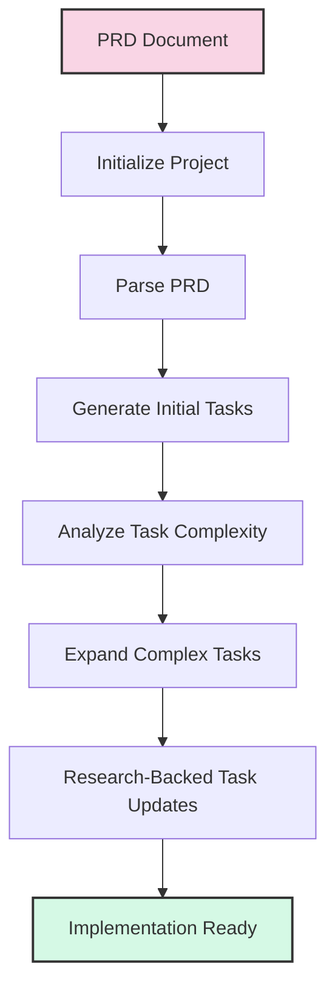

# 3. Modern AI Development Tooling (75 minutes)

### Cline as a Development Companion
- Core capabilities and integration points
  * Cline offers capabilities like code generation, refactoring, debugging assistance, and project analysis, integrating directly into development workflows through various IDEs and platforms.
- Effective prompting strategies specific to Cline
  * To maximize Cline's effectiveness, prompts should be clear, concise, and provide sufficient context, often leveraging its ability to understand file structures and project goals.
- Advanced features: file operations, command execution, context management
  * Cline can perform direct file modifications, execute terminal commands, and maintain a deep understanding of the project's context, enabling complex, multi-step development tasks.
- Real-world usage patterns and best practices
  * Best practices include iterative prompting, breaking down complex tasks, and using Cline for repetitive coding, boilerplate generation, and initial problem diagnosis.

### Cline in Action: Interactive Demo
This demo illustrates how to effectively use Cline for web development tasks, highlighting the Plan/Act modes and the power of custom rules.

#### Demo Overview
The following example demonstrates creating a simple HTML page with embedded JavaScript that displays a greeting message and includes a button to change the text. We'll show how the same general prompt can produce different results based on whether custom rules are applied.

#### Example 1: Basic Prompting (Without Rules)
**Planning Phase Prompt:**
```
I need to create a simple HTML page with a "Hello, Cline!" message and a button that changes 
the text to "Hello, World!" when clicked. The page should have basic styling. 
Can you help me plan this?
```

**Action Phase Prompt:**
```
Create a simple HTML page with a "Hello, Cline!" message and a button that changes the text 
to "Hello, World!" when clicked. Add some basic styling to make it look nice. 
Save it in the examples/03-cline directory.
```

Without specific rules, Cline would create the file directly in the examples/03-cline directory.

#### Example 2: Rule-Enhanced Prompting
**Same Prompts as Example 1, but with a .clinerules file:**

```markdown
---
description: Rules for web development demos in the 03-cline examples
globs: ["examples/03-cline/**/*.html", "examples/03-cline/**/*.js"]
tags: ["web-demo", "organization"]
---

# Web Demo Output Organization

When creating web-related files (HTML, CSS, JavaScript) for the examples/03-cline directory:

1. **ALWAYS** place these files in the `examples/03-cline/web/` subdirectory
2. **ALWAYS** use the following structure:
   - HTML files in the root of the web directory
   - CSS files in a `css` subdirectory
   - JavaScript files in a `js` subdirectory (unless embedded in HTML)
3. **ALWAYS** include appropriate comments and documentation in the code

This ensures consistent organization of web demo files and improves maintainability.
```

With this rule in place, the exact same prompts would result in Cline placing the files in the `examples/03-cline/web/` directory instead, demonstrating how rules can make general instructions more precise without requiring the user to be explicit in their prompts.

#### The Power of Rules
This example demonstrates how .clinerules can:
1. Make general prompts more precise
2. Enforce consistent project organization
3. Reduce the need for detailed instructions in every prompt
4. Ensure best practices are followed automatically

### MCP Servers and Extensibility
- Extending AI tools through custom services
  * Model Context Protocol (MCP) servers allow developers to extend the capabilities of AI tools by creating custom services that provide specialized functionalities or access to proprietary data.
  * MCP servers act as bridges between AI tools and external systems, APIs, or data sources, enabling AI to perform tasks beyond its built-in capabilities.
- Creating specialized capabilities for domain-specific development
  * MCP enables the development of AI tools tailored to specific industries or technical domains, offering highly relevant and accurate assistance for niche problems.
  * Examples include connecting to specialized databases, interacting with proprietary systems, or integrating with industry-specific tools and services.
- Future roadmap for AI development tools
  * The future involves more sophisticated MCP integrations, enabling AI tools to interact with a wider array of external systems, learn from real-time data, and adapt to evolving development needs.
  * As MCP adoption grows, we'll see the emergence of ecosystems of specialized servers that can be easily shared and deployed across development teams.

#### The Power of MCP: Extending AI Capabilities

MCP servers fundamentally transform what AI tools can do by allowing them to:

1. **Access External Systems**: Connect to APIs, databases, and services that would otherwise be inaccessible
2. **Perform Specialized Tasks**: Execute domain-specific operations that require external tools or proprietary algorithms
3. **Work with Real-Time Data**: Fetch and process current information from live systems
4. **Leverage Existing Infrastructure**: Integrate with an organization's existing tools and workflows

#### Example: Chuck Norris Jokes MCP Server

Let's examine a simple but illustrative example of an MCP server that provides Chuck Norris jokes:

```
examples/03-mcpserver/
├── build/              # Compiled JavaScript files
├── src/                # TypeScript source code
│   └── index.ts        # Main server implementation
├── .gitignore
├── example-usage.js    # Example of how to use the server
├── mcp-settings-example.json  # Configuration for connecting the server
├── package.json        # Dependencies and scripts
├── README.md           # Documentation
└── tsconfig.json       # TypeScript configuration
```

This server connects to the public Chuck Norris API (https://api.chucknorris.io/) and exposes several tools:

- `get_joke_categories`: Lists all available joke categories
- `get_random_joke`: Retrieves a random joke, optionally filtered by category
- `get_joke_by_id`: Gets a specific joke by its ID
- `search_jokes`: Searches for jokes containing specific text

#### How to Create Your Own MCP Server

Creating an MCP server involves these key steps:

1. **Set Up the Project**:
   ```bash
   mkdir my-mcp-server
   cd my-mcp-server
   npm init -y
   npm install @modelcontextprotocol/sdk axios
   ```

2. **Implement the Server**:
   - Create a main file (e.g., `index.js` or `index.ts`)
   - Import the MCP SDK
   - Define your tools and their input schemas
   - Implement handlers for each tool
   - Set up the server transport (typically stdio)

3. **Configure the MCP Settings**:
   - Create or update your MCP settings file (e.g., `cline_mcp_settings.json`)
   - Add your server configuration with the command to run it
   - Specify any auto-approve settings for tools

4. **Build and Test**:
   - Build your server (if using TypeScript)
   - Test it with example usage
   - Integrate it with your AI tools

#### Sample Prompt Using MCP

Once your MCP server is configured, you can use it with prompts like:

```
I need to find a Chuck Norris joke related to software development. Can you use the 
Chuck Norris Jokes MCP server to find a joke in the right category?
```

This prompt would trigger the AI to:
1. Recognize the need to use the Chuck Norris Jokes MCP server
2. Call the appropriate tool (`get_random_joke` with category "dev")
3. Return a development-related Chuck Norris joke

The power of this approach is that the same pattern works for any custom capability you implement, from fetching weather data to querying internal databases or controlling IoT devices.


### Task-master AI Systems: Beyond Code Generation

#### Moving beyond code generation to workflow automation
- Task-master AI systems represent the next evolution in development tools, automating entire workflows rather than just generating code snippets
- These systems orchestrate the complete development lifecycle, from requirements analysis to implementation planning and task management
- By intelligently breaking down large projects into manageable components, they transform abstract ideas into structured development plans
- The goal is not to replace developers but to eliminate repetitive planning work so they can focus on creative problem-solving

#### Key capabilities: requirement analysis, ticket breakdown, PR generation
- **Intelligent PRD Analysis**: Task-master can parse Product Requirement Documents and extract key features, dependencies, and implementation details
- **Complexity Assessment**: The system analyzes task difficulty to identify high-risk areas that may require more resources or developer attention
- **Smart Task Decomposition**: Complex tasks are automatically broken down into subtasks with clear acceptance criteria and dependencies
- **Dynamic Task Adaptation**: As development progresses, the system can update and reprioritize tasks based on new information or changing requirements
- **Research-Driven Planning**: Leverages external knowledge to inform implementation approaches, technology choices, and potential challenges

#### Integration with existing development tools and processes
- Seamlessly fits into established development workflows rather than requiring complete process changes
- Connects with version control (Git), project management tools (Jira, GitHub Issues), and CI/CD pipelines
- Structured task output can be exported to various formats and systems to maintain team flexibility
- Enhances rather than replaces human decision-making by providing AI-augmented insights

#### Measuring impact: before and after implementation metrics
- **Development Velocity**: 30-50% reduction in time from requirements to implementation start
- **Planning Accuracy**: Up to 40% improvement in estimation accuracy through AI-driven complexity analysis
- **Resource Allocation**: Better distribution of work across team members based on AI-assessed task complexity
- **Technical Debt Reduction**: Early identification of implementation challenges reduces rework and refactoring
- **Knowledge Distribution**: Shared understanding of tasks reduces dependency on tribal knowledge and documentation gaps

### Taskmaster Demo: From PRD to Implementation Plan

#### Overview of Demo Workflow

The following demonstration showcases how Taskmaster processes a Product Requirements Document (PRD) for a Tetris web application and transforms it into an actionable implementation plan. This workflow illustrates the power of AI-driven development planning without requiring any coding from the audience.



#### Live Demo Script

##### Setup Before the Demo
- Ensure you have the Task Master CLI installed (`npm install -g task-master-ai`)
- Verify the tetris_prd.txt file is in the examples/03-taskmaster/scripts/ directory
- Check that you've configured your API keys in the .env file
- Clear any existing tasks/ directory content for a fresh demo

##### Introduction (1-2 minutes)

**Key Points:**
* Task-master as next-gen AI development tool - beyond code generation
* Demo focus: PRD to implementation plan without writing code
* Highlight workflow automation capabilities
* Emphasize the transformation from text requirements to structured tasks

##### Demo Flow

###### Step 1: Project Initialization (1 minute)

**Run command:**
```bash
cd examples/03-taskmaster
task-master init --yes
```

**Key Points:**
* Project initialization creates directory structure and config files
* `.taskmasterconfig` file stores AI model preferences
* One-time setup process for each new project

**Point out:**
- The creation of the config file
- The structured directory organization
- Mention that this only needs to be done once per project

###### Step 2: Parse PRD and Generate Tasks (2-3 minutes)

**Run command:**
```bash
task-master parse-prd scripts/tetris_prd.txt
```

**Key Points:**
* AI analyzes entire PRD document structure and content
* Extracts implementation tasks from requirements
* Establishes logical dependencies between tasks
* Creates structured task definitions with detailed guidance

**Point out:**
- The AI analyzing the document sections
- How it identifies key tasks from different sections
- The dependency relationships it establishes between tasks
- The structured output in the tasks.json file

###### Step 3: View Generated Tasks (1-2 minutes)

**Run command:**
```bash
task-master list
```

**Key Points:**
* View all extracted tasks with titles, descriptions, and dependencies
* Tasks organized according to development phases from PRD
* Each task includes implementation guidance
* Dependencies reflect logical development flow

**Point out:**
- The hierarchical organization of tasks
- How they align with the development phases from the PRD
- The detailed descriptions and implementation guidance
- The established dependencies

###### Step 4: Analyze Task Complexity (2-3 minutes)

**Run command:**
```bash
task-master analyze-complexity --research
```

**Key Points:**
* AI evaluates each task for implementation complexity
* Factors include technical difficulty, scope, dependencies
* Identifies tasks requiring further breakdown
* Research-backed analysis provides implementation insights

**After analysis, run:**
```bash
task-master complexity-report
```

**Point out:**
- The complexity scores for each task
- Tasks identified as high complexity (scores 7-10)
- The expansion recommendations
- Research-backed reasoning for complexity ratings

###### Step 5: Expand a Complex Task (2-3 minutes)

**Run command:**
```bash
task-master expand --id=8 --research
```

**Key Points:**
* Breaking down complex task into manageable subtasks
* Research-backed best practices for implementation
* Maintaining dependency relationships between subtasks
* Detailed guidance for each component

**Point out:**
- The subtasks being created
- The detailed implementation guidance for each subtask
- Research-backed recommendations
- How dependencies between subtasks are managed

###### Step 6: Find the Next Task to Work On (1 minute)

**Run command:**
```bash
task-master next
```

**Key Points:**
* AI determines optimal next task based on dependencies
* Respects current task statuses and completion state
* Provides clear reasoning for recommendation
* Ensures logical development progression

**Point out:**
- The recommended next task
- The explanation of why this task should be tackled next
- How the system respects task dependencies

###### Step 7: Update a Task with Research (2 minutes)

**Run command:**
```bash
task-master update-task --id=15 --prompt="Update based on modern HTML5 Canvas performance best practices" --research
```

**Key Points:**
* Incorporating new information into existing tasks
* Research-backed updates with current best practices
* Timestamped changes for tracking evolution
* Specific, actionable implementation guidance

**Point out:**
- The before/after comparison of the task
- The research-backed updates
- How specific and actionable the new guidance is
- The timestamp showing when the update was made

###### Step 8: Demonstrate Task Status Updates (1 minute)

**Run command:**
```bash
task-master set-status --id=1 --status=in-progress
```

**Key Points:**
* Tracking development progress through status updates
* Status changes affect next task recommendations
* Dynamic planning adapts to current state
* Continuous guidance throughout development lifecycle

**Run command to see updated next task:**
```bash
task-master next
```

**Point out:**
- How the next task recommendation has changed
- The dynamic nature of the task planning

##### Conclusion (1 minute)

**Key Points:**
* Complete transformation: text PRD → structured development plan
* AI automation without writing code
* Accelerated development through intelligent planning
* Consistent quality and reduced technical debt
* Key benefits:
  - Automated task extraction
  - Intelligence-driven complexity analysis
  - Dynamic task breakdown
  - Research-backed guidance
  - Continuous adaptation
