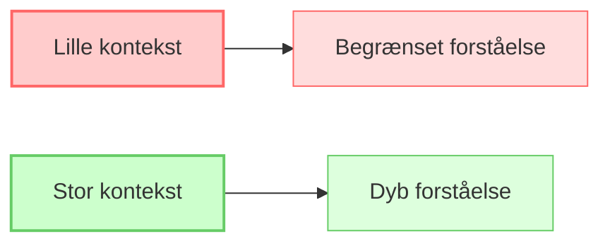

# 🧠 2. LLM Landskab og Kapaciteter

---
layout: default
---

# 🔍 Forståelse af Forskellige LLM Arkitekturer

<v-clicks>

## 🏗️ Foundation vs. specialiserede modeller

- 🌐 **Foundation Modeller:** 
  * 🐘 Store, generelle LLM'er
  * 📚 Trænet på omfattende datasæt
  * 🎯 Bred vifte af opgaver

- 💻 **Specialiserede Kodningsmodeller:**
  * ⚙️ Finjusteret til koderelaterede opgaver
  * 🧩 Ekspertise inden for kodegenerering
  * 🔧 Optimeret til programmeringssprog

</v-clicks>

<v-clicks>

## 🪟 Kontekstvinduer

- 📏 Maksimal mængde tekst (tokens) en LLM kan behandle
- 📈 Større kontekstvindue giver:
  * 🧐 Bedre forståelse af kodebasen
  * 🔄 Mere sammenhængende kodegenerering
  * ✅ Præcisere løsninger for komplekse problemer

</v-clicks>

---
layout: two-cols
---

# 🔑 Nøgledifferentiatorer i Kodnings-LLM'er

<v-clicks>

## 🎯 Instruktionsfølgning vs. kreativ problemløsning
- 📝 **Instruktionsfølgning:** Nøjagtig udførelse af eksplicitte kommandoer
- 💡 **Kreativ Problemløsning:** Evne til at udtænke nye løsninger

## 🧩 Koderæsonneringsevner
- 🔍 Forståelse af logik, struktur og hensigt bag kode
- 🐛 Fejlfinding og omstrukturering
- ✨ Generering af funktionelt korrekte løsninger

</v-clicks>

::right::

<v-clicks>

## 🛠️ Værktøjsbrugende kapaciteter
- 🔌 Interaktion med eksterne værktøjer
- 📡 API-kald for at indsamle information
- 🤖 Udførelse af handlinger ud over tekstgenerering

## 📊 Struktureret outputgenerering
- 📋 Produktion af JSON, XML eller CSV
- 🔄 Problemfri integration med automatiserede systemer
- 📏 Konsistente, analyserbare outputs

</v-clicks>

---
layout: default
---

# 🔬 Praktisk Sammenligning

<v-clicks>

## 🔄 Samme prompt, forskellige outputs
- 🎨 Forskellige LLM'er producerer distinkte kodningsstile
- 🛠️ Varierende tilgange til fejlhåndtering
- 🧩 Unikke problemløsningsstrategier

## 🐛 Fejlfindingsstrategier
- 🔧 Specifikke koderettelser
- 📚 Konceptuelle forklaringer
- 🧪 Testmetodologier

</v-clicks>

  
Sammenligning:

  
Forskellige modeller har unikke styrker og svagheder i kodningsscenarier! 🧩

<v-clicks>

## ⚡ Optimering af prompts
- 🎯 Tilpasning til specifikke modelarkitekturer
- 🔍 Fremhævelse af klarhed for Claude
- 📋 Detaljerede eksempler for GPT-4

## 🎬 Live Demo: Sammenligning af LLM-Responser
- 💬 Forskellige responsstile og kapaciteter
- 📊 Opgavespecifikke præstationsvariationer
- 💡 Indsigter i prompt-optimering

</v-clicks>

  
Pro Tip:

  
Vælg den rette model til den specifikke opgave! 🎯

