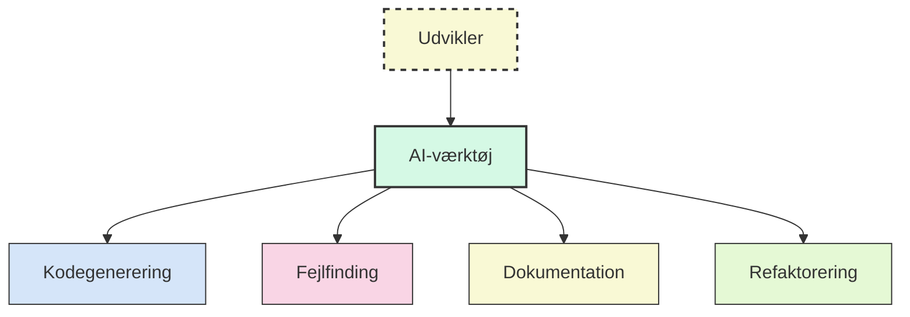

# 🛠️ 3. Moderne AI-udviklingsværktøjer

---
layout: default
---

# 🧰 Oversigt over AI-Udviklingsværktøjer

<v-clicks>

## 📋 Kategorier af værktøjer

- 👨‍💻 **Kode-assistenter:** GitHub Copilot, Cody, Cursor
- 💬 **Chatbots:** ChatGPT, Claude, Bard
- 🔧 **Specialiserede værktøjer:** Cline, Devin, TaskMaster
- 🖥️ **Lokale modeller:** Ollama, LM Studio

</v-clicks>

## 🔑 Nøglefunktioner

- ✍️ Kodegenerering og -fuldførelse
- 🐛 Fejlfinding og -rettelse
- 📝 Dokumentationsgenerering
- 🔄 Kodeforklaring og -refaktorering

<v-clicks>

## 🔌 Integrationsmetoder

- 🧩 IDE-plugins
- 💻 CLI-værktøjer
- 🌐 Web-applikationer
- 🔄 API-integrationer

</v-clicks>

---
layout: two-cols
---

# 🤖 Cline.Bot:

<v-clicks>

## 🔑 Nøglefunktioner
- 🛠️ **Værktøjsanvendelse:** Direkte interaktion med systemet
- 🧠 **Kontekstbevidsthed:** Forståelse af projektstruktur
- 📂 **Filhåndtering:** Læsning og skrivning af filer
- 💻 **Kommandoudførelse:** Kørsel af CLI-kommandoer

## 📈 Fordele
- ⚡ Reduceret kontekstskift for udviklere
- 🚀 Øget produktivitet gennem automatisering
- ✨ Forbedret kodekvalitet
- 🔄 Accelereret onboarding af nye udviklere

</v-clicks>

::right::

<v-clicks>

## 🎯 Anvendelsesområder
- 🏗️ Projektopsætning og scaffolding
- 💻 Kompleks kodegenerering
- 🐛 Fejlfinding og -rettelse
- 📝 Dokumentationsgenerering
- 🔄 Refaktorering og kodeoptimering

## 🔌 Integrationer
- 💻 VS Code
- 📟 Terminal
- 🌐 Web

</v-clicks>

  
Effektivitet:

  
Cline reducerer udviklingstiden med op til 40% på komplekse projekter! ⚡

---
layout: default
---

# 🔄 MCP: Model Context Protocol

<v-clicks>

## 🤔 Hvad er MCP?
- 📊 Standardiseret protokol for AI-modelinteraktion
- 🛠️ Muliggør værktøjsanvendelse og ressourceadgang
- 🚀 Udvider AI-modellers kapaciteter

</v-clicks>
<v-clicks>

## 🧩 Nøglekomponenter
- 🖥️ **Servere:** Tilbyder værktøjer og ressourcer
- 🔧 **Værktøjer:** Udførelse af specifikke handlinger
- 📚 **Ressourcer:** Adgang til eksterne data

</v-clicks>

<v-clicks>

## 📈 Fordele ved MCP
- 🔄 Standardiseret grænseflade på tværs af modeller
- 🧩 Modulær og udvidelig arkitektur
- 🔒 Forbedret sikkerhed og kontrol
- 💬 Reduceret prompt-engineering kompleksitet

## 🎯 Anvendelseseksempler
- 🔌 API-integrationer
- 🗄️ Databaseadgang
- 📂 Filsystemoperationer
- 🔧 Specialiserede værktøjer for domænespecifikke opgaver

</v-clicks>

---
layout: default
---

# 📋 TaskMaster: AI-Drevet Projektledelse

<v-clicks>

## 🔑 Nøglefunktioner
- 🤖 **Automatisk opgavegenerering** fra PRD
- 📊 **Kompleksitetsanalyse** af opgaver
- 🔄 **Afhængighedsstyring** mellem opgaver
- 🧠 **AI-assisteret opgaveopdatering**

## 🔄 Arbejdsgang
1. 🏁 Initialisering af projekt
2. 📝 Parsing af PRD
3. ✨ Generering af opgaver
4. 🔍 Ekspansion til delopgaver
5. 📈 Statussporing og -opdatering

</v-clicks>

<v-clicks>

## 📈 Fordele
- ⏱️ Reduceret planlægningstid
- 🔍 Forbedret opgavegranularitet
- 📊 Konsistent opgavestruktur
- 📝 Automatiseret dokumentation

## 🔄 Integration med udviklingsprocesser
- 🔄 Kompatibel med agile metodologier
- 🚀 Understøtter CI/CD-pipelines
- 🔌 Integrerer med eksisterende projektledelsesværktøjer
- 🧩 Tilpasningsbar til forskellige teamstørrelser

</v-clicks>

