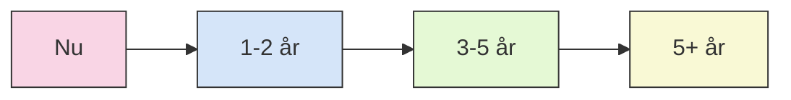

# 👥 5. Indvirkning på Udviklingsteams

---
layout: default
---

# 🔄 Ændringer i Udviklerroller og -kompetencer

<v-clicks>

## 🌟 Nye udviklerkompetencer
- 💬 **Prompt-engineering:** Effektiv kommunikation med AI
- 🛠️ **AI-værktøjsekspertise:** Maksimering af værktøjseffektivitet
- 🏗️ **Systemdesign på højere niveau:** Fokus på arkitektur frem for implementering
- 🔍 **Validering og kvalitetssikring:** Kritisk vurdering af AI-output

## 👥 Ændrede teamstrukturer
- 📉 Færre juniorudviklere til rutineopgaver
- 📈 Flere systemarkitekter og designere
- 🆕 Nye roller: AI-specialister og prompt-ingeniører
- 🧠 Øget fokus på forretningsdomæneviden

</v-clicks>

<v-clicks>

## 📚 Kompetenceudvikling
- 🔄 Kontinuerlig læring og tilpasning
- 🎯 Fokus på domænespecifik viden
- 🧩 Dybere forståelse af systemarkitektur
- 💬 Forbedrede kommunikationsevner

## 🛣️ Karriereveje
- 🤖 Specialisering i AI-assisteret udvikling
- 🏗️ Fokus på systemdesign og arkitektur
- 💬 Prompt-engineering som karrierevej
- 🔍 Domæneekspertise kombineret med teknisk viden

</v-clicks>

  
Fremtidens udvikler:

  
Kombinerer domæneviden, systemdesign og AI-orkestrering! 🚀

---
layout: two-cols
---

# 🏢 Organisatoriske Ændringer og Udfordringer

<v-clicks>

## 📈 Produktivitetsgevinster
- ⚡ Accelererede udviklingstider
- 💰 Reducerede omkostninger for rutineopgaver
- ✨ Forbedret kodekvalitet og konsistens
- 🚀 Hurtigere time-to-market

## 🚧 Udfordringer ved adoption
- 🛑 Modstand mod forandring
- 🔒 Bekymringer om jobsikkerhed
- 📚 Læringskurve for effektiv AI-anvendelse
- 🔄 Integration i eksisterende processer

</v-clicks>

  
Organisatorisk udfordring:

  
Succesfuld AI-adoption kræver både teknisk og kulturel transformation! 🔄

::right::

<v-clicks>

## 🧐 Etiske overvejelser
- 🔗 Afhængighed af proprietære AI-modeller
- ©️ Intellektuel ejendomsret for AI-genereret kode
- 🔒 Sikkerhedsimplikationer af AI-genereret kode
- ⚖️ Ansvar for fejl i AI-genereret kode

## 🔧 Implementeringsstrategier
- 📈 Gradvis integration i eksisterende processer
- 🎓 Træning og uddannelse af teams
- 📋 Etablering af retningslinjer og best practices
- 🔄 Kontinuerlig evaluering og tilpasning

</v-clicks>

  
Nøgle til succesfuld adoption:

  
Fokus på mennesker og processer, ikke kun teknologi! 🧠

---
layout: default
---

# 🔮 Fremtidsperspektiver

<v-clicks>

## 🔜 Kortsigtede trends (1-2 år)
- 📈 Øget adoption af AI-assisteret udvikling
- 🛠️ Forbedrede værktøjer med dybere integration
- 📋 Standardisering af AI-assisteret arbejdsgang
- 🎯 Specialiserede AI-modeller for specifikke domæner

## 🔜🔜 Mellemsigtede trends (3-5 år)
- 🤝 AI som standard udviklingspartner
- 🤖 Automatisering af komplekse udviklingsopgaver
- 💻 Nye programmeringssprog optimeret til AI-samarbejde
- 🎓 Ændrede uddannelseskrav for udviklere

</v-clicks>

<v-clicks>

## 🔮 Langsigtede perspektiver (5+ år)
- 🔄 Fundamental ændring af softwareudviklingsprocessen
- 🤖 AI-drevet automatisering af hele udviklingslivscyklussen
- 🎯 Fokus på intention og forretningsresultater frem for implementering
- 👥 Nye roller og karriereveje inden for softwareudvikling

## 📊 Strategiske overvejelser
- 💰 Investering i AI-kompetencer og -værktøjer
- 🎓 Tilpasning af rekrutterings- og uddannelsesstrategier
- 🔄 Omtænkning af udviklingsprocesser og -metoder
- ⚖️ Balancering af menneskelig ekspertise og AI-kapaciteter

</v-clicks>

  
Fremtidens vindere:

  
Organisationer der effektivt kombinerer menneskelig kreativitet med AI-effektivitet! 🚀

---
layout: center
class: text-center
---

# 🙏 Tak for opmærksomheden!

Spørgsmål? 🤔

  
    Kilder og ressourcer <carbon:arrow-right class="inline animate-pulse"/>
  

  <a href="mailto:contact@ai-vibe.com" class="text-xl opacity-50 !border-none !hover:text-white">
    <carbon:email />
  </a>
  <a href="https://github.com/ai-vibe" target="_blank" class="text-xl opacity-50 !border-none !hover:text-white">
    <carbon:logo-github />
  </a>
  <a href="https://twitter.com/ai_vibe" target="_blank" class="text-xl opacity-50 !border-none !hover:text-white">
    <carbon:logo-twitter />
  </a>

---
layout: default
---

# 📚 Kilder og Ressourcer

## 📄 Artikler og Publikationer
- 📊 "The Impact of AI on Software Development" - IEEE Software
- 💬 "Prompt Engineering: A New Paradigm" - ACM Digital Library
- 👨‍💻 "AI-Assisted Development: Case Studies" - O'Reilly Media
- 🔮 "The Future of Programming" - Martin Fowler's Blog

## 🛠️ Værktøjer og Platforme
- 🤖 [Cline Documentation](https://cline.tools)
- 📋 [TaskMaster GitHub Repository](https://github.com/taskmaster-ai)
- 🔄 [MCP Specification](https://modelcontextprotocol.github.io)
- 🖥️ [Slidev Presentation Framework](https://sli.dev)

## 📚 Yderligere Læsning
- 🧠 "AI-Assisted Software Engineering" - Cambridge University Press
- 💬 "Prompt Engineering for Developers" - Manning Publications
- 🔄 "The New Developer Workflow" - Pragmatic Bookshelf
- 🏢 "AI Tools in Enterprise Development" - Gartner Research

## 📞 Kontakt og Support
- ✉️ Email: contact@ai-vibe.com
- 💻 GitHub: [github.com/ai-vibe](https://github.com/ai-vibe)
- 🐦 Twitter: [@ai_vibe](https://twitter.com/ai_vibe)
- 🔗 LinkedIn: [AI-Vibe](https://linkedin.com/company/ai-vibe)

  

    
Ressourcer:

    
Scan QR-koden for at få adgang til alle præsentationsmaterialer! 📱

  

